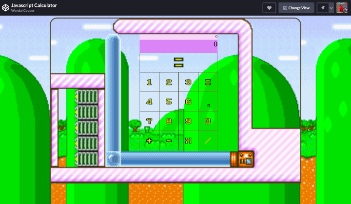

# [JavaScript Calculator]()
An updated version of my Yoshi's Cookie-themed calculator.

## Purpose/Goal
I just wanted to improve upon my original project with new ideas and techniques that I picked up since then.

## Operation
Click on the calculator's keys and calculate simple expressions.

## Tech/Libraries Used
* HTML
* CSS
* JavaScript
* React
